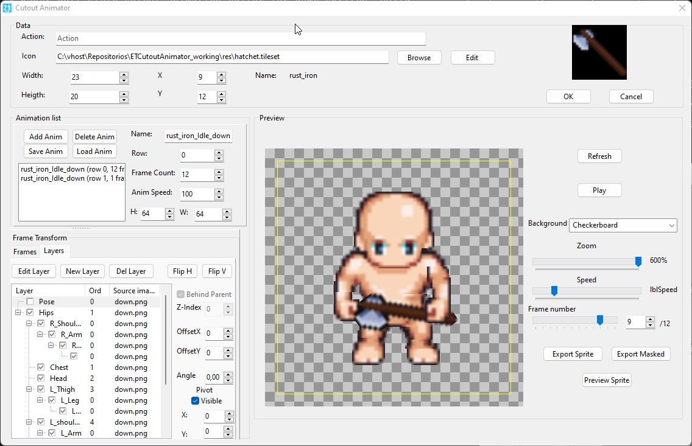
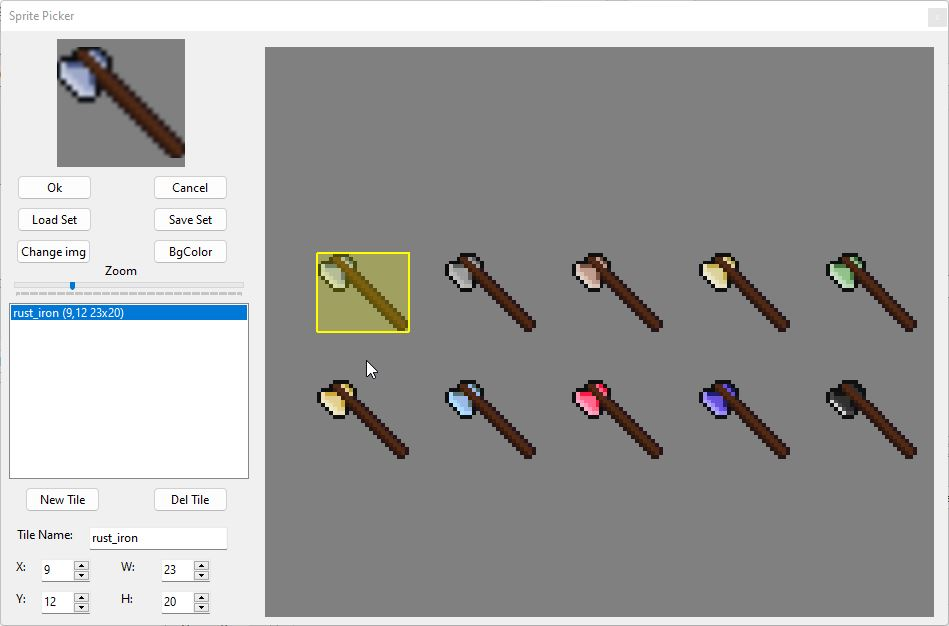
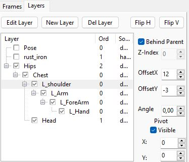
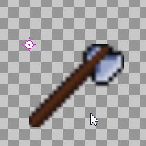
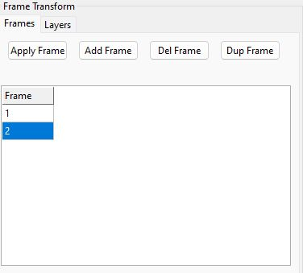
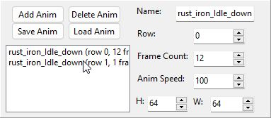
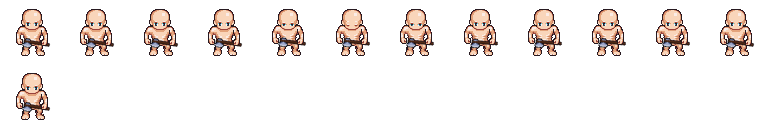
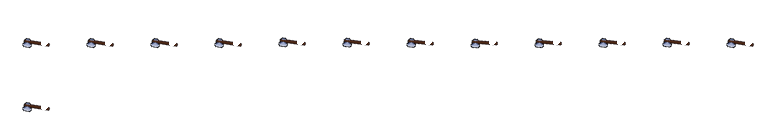
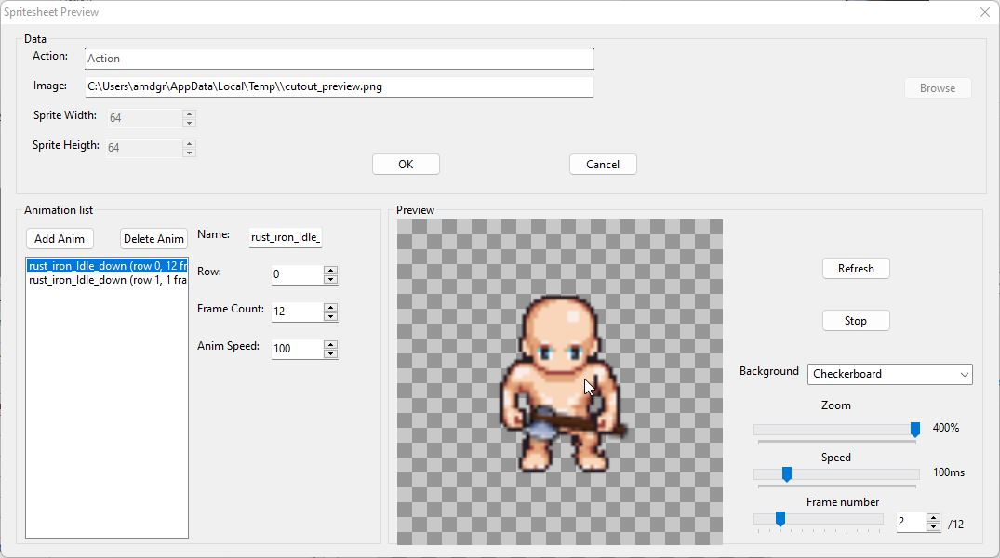
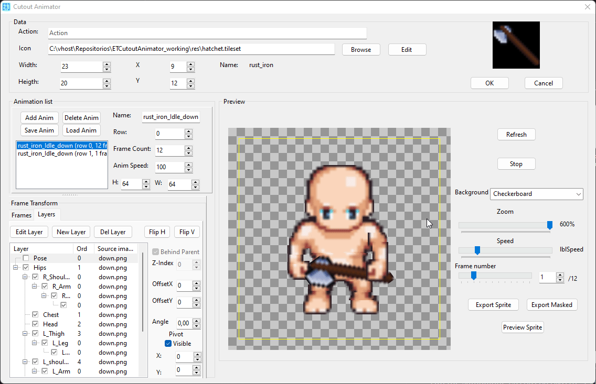

# Cutout Animator — Operating Guide


A paper-doll style cutout animation editor for game sprites. Build characters
or objects from layered tiles, pose them per frame, and export tightly-packed
spritesheets with metadata for your game engine.




---

## Quick Start

1. **Open the animator** — from the Object Editor, select an object, click
   **Edit Animations** (or run the standalone `CutoutAnimator.exe`).
2. **Load a tileset** — click **Browse** to pick a `.tileset` / image file.
   Pick a tile from the sprite picker → it becomes the first layer.


 
 
3. **Add layers** — click **New Layer** to pick another tile. Each layer is
   a body part (arm, leg, head, weapon, etc.).
4. **Arrange layers** — drag layers in the tree to reorder or nest them.
   Drop ON a layer to make it a child (limb pinned to a joint).
5. **Pose** — set Offset X/Y, Angle, Pivot X/Y per layer. Children inherit
   the parent's transform (rotate the torso → arms swing with it).
6. **Add frames** — click **Dup Frame** to copy the current pose, then
   tweak it for the next animation step.
7. **Export** — click **Export SprSet** for a full spritesheet PNG + JSON,
   or **Export MskSet** for an icon-only masked sheet.

---

## The Layer Tree (VirtualStringTree)




The tree on the left shows all layers in the current frame.

| Action | How |
|---|---|
| **Select a layer** | Click it (parent or child) |
| **Reorder siblings** | Drag a layer above/below another |
| **Make a child** | Drag a layer ONTO another (drop on the node) |
| **Move to root** | Drag a layer to empty space |
| **Toggle visibility** | Click the checkbox |
| **Delete** | Select, click **Del Layer** |

### Draw order = tree order

Layers are drawn top-to-bottom in the tree. The first layer is drawn first
(appears behind), the last is drawn last (appears in front). Drag to reorder.

### "Behind Parent" checkbox

For side-view characters: check **Behind Parent** on a child layer (e.g. back
arm) to draw it BEHIND its parent (torso) instead of on top. The child still
inherits the parent's transform — it's purely a draw-order override.

---

## Layer Properties

When a layer is selected, the right panel shows its properties:

| Field | What it does |
|---|---|
| **Offset X / Y** | Position relative to parent (or frame center for roots) |
| **Angle** | Rotation in degrees (around the pivot) |
| **Pivot X / Y** | Rotation pivot in tile-local coordinates (0,0 = top-left) |
| **Flip H** | Mirror the tile left/right |
| **Flip V** | Mirror the tile up/down |
| **Behind Parent** | Draw this layer behind its parent (child layers only) |

### Pivot marker




A magenta crosshair shows the selected layer's pivot point in the preview.
Toggle visibility with the **Pivot Vis** checkbox. The marker is a visual
aid only — it's not part of the exported spritesheet.

### Transform inheritance

Children inherit their parent's transform:
- **Offset**: a child's offset is relative to the parent's position
- **Angle**: a child's angle ADDS to the parent's angle
- **Rotation**: when a parent rotates, children swing around the parent's pivot

Example: rotate the torso 30° → the arm (child) swings 30° around the torso's
pivot, plus any additional angle you set on the arm itself.

---

## Frames



Each animation has one or more frames. A frame is a complete pose (a snapshot
of all layer positions/angles).

| Button | Action |
|---|---|
| **Add Frame** | Append an empty frame |
| **Dup Frame** | Duplicate the current frame (copy all layers + transforms) |
| **Del Frame** | Delete the current frame |

### Workflow

1. Build the resting pose in frame 0
2. Click **Dup Frame** → frame 1 is an exact copy
3. Adjust a few layers (e.g. raise the arm)
4. Click **Dup Frame** again → frame 2 copies frame 1
5. Continue for the full animation

Use the frame trackbar or spin edit to step through frames. Click **Play**
to preview the animation at the recorded speed.

---

## Animations



An animation is a sequence of frames played at a specific speed. Each
animation becomes one row in the exported spritesheet.

| Button | Action |
|---|---|
| **Add Anim** | Create a new empty animation |
| **Delete Anim** | Delete the current animation |
| **Load Anim** | Load a `.anim` file (replaces current animation) |
| **Save Anim** | Save the current animation to a `.anim` file |

### Animation properties

| Field | What it does |
|---|---|
| **Name** | Animation name (e.g. "walk", "attack") |
| **Row** | Row index in the exported spritesheet |
| **Frame Count** | Number of frames |
| **Frame W / H** | Per-frame dimensions (pixels) |
| **Speed (ms)** | Milliseconds per frame (100 = 10 FPS) |

Each animation can have different frame dimensions — the spritesheet packs
them tightly with per-animation metadata in the JSON.

---

## Export

### Export SprSet (full spritesheet)



Composites all layers for every frame of every animation into a single PNG.
Each animation = one row, each frame = one column. Tightly packed — no gaps
between frames.

Also writes a `.spritesheet` JSON file with per-animation metadata:
frame count, frame size, speed, row position.

### Export MskSet (action icon masked)



Renders only the layers matching the "action icon" tile (the tile loaded
via **Browse** / **Edit**), masked by overlapping layers. Useful for
generating item sprites that show only the item, cut out where other
layers (hands, equipment) cover it.

### Preview Sprite




Renders a full spritesheet to a temp file and opens the **Spritesheet
Preview** dialog. Step through frames, play animations, verify the export
before saving to a final path.

---

## Spritesheet Format

### PNG layout

```
┌─────────────────────────────────────────┐
│ frame0 │ frame1 │ frame2 │ ... │ frameN │  ← animation 0 (row 0)
├────────┼────────┼────────┼─────┼────────┤
│ frame0 │ frame1 │ frame2 │ ... │ frameN │  ← animation 1 (row 1)
├────────┼────────┼────────┼─────┼────────┤
│ ...                                       │
└─────────────────────────────────────────┘
```

- Each animation occupies one row (by `RowIndex`)
- Frames are placed edge-to-edge (no gaps)
- Different animations can have different frame sizes
- Sheet width = max(frameW × frameCount) across all animations
- Sheet height = sum of all frameH

### JSON metadata (`.spritesheet`)

```json
{
  "cellW": 48,
  "cellH": 48,
  "columns": 8,
  "rows": 3,
  "sheetW": 288,
  "sheetH": 144,
  "image": "spritesheet.png",
  "animations": [
    {
      "name": "walk",
      "row": 0,
      "frameCount": 8,
      "frameW": 32,
      "frameH": 48,
      "speedMs": 100,
      "rowY": 0,
      "frameX": 0
    }
  ]
}
```

### Reading a frame in your game engine

For animation `i`, frame `j`:
```
X = frameX + j * frameW
Y = rowY
W = frameW
H = frameH
```

Like reading a fixed-stride sequential register file — one stride per
animation.

---

## File Formats




| Extension | Description |
|---|---|
| `.anim` | Single animation (JSON): frames, layers, transforms |
| `.png` | Spritesheet image |
| `.spritesheet` | Spritesheet metadata (JSON) |
| `.objs` | Object editor file (contains object definitions + action references) |
| `.tileset` | Tileset descriptor (JSON, for the sprite picker) |

---

## Tips

- **Start simple** — build a front-facing character first (all children on
  top of the body), then tackle side-view (uses "Behind Parent").
- **Set pivots at joints** — for an arm, put the pivot at the shoulder;
  for a leg, at the hip. Rotation then looks natural.
- **Duplicate frames** — always duplicate the previous frame and tweak,
  rather than rebuilding poses from scratch.
- **Hide layers while editing** — uncheck a layer's visibility checkbox
  to see what's behind it. Children inherit invisibility.
- **Zoom for precision** — use the zoom trackbar when fine-tuning offsets.
  The layout scales uniformly (tiles + offsets together).
- **Test with Preview Sprite** — before exporting to a final path, use
  Preview Sprite to verify the animation plays correctly in the
  spritesheet dialog.

---

## Standalone Executable

The animator can run as a standalone `.exe` (no plugin host required).

- **OK** — saves all animations to their `.anim` files, stays open
- **Cancel** — exits the application
- **Load Anim** — opens a `.anim` file
- **Save Anim** — saves the current animation

The standalone is useful for building animations without launching the
full object editor. All features (layer editing, preview, export) work
identically to the plugin version.
